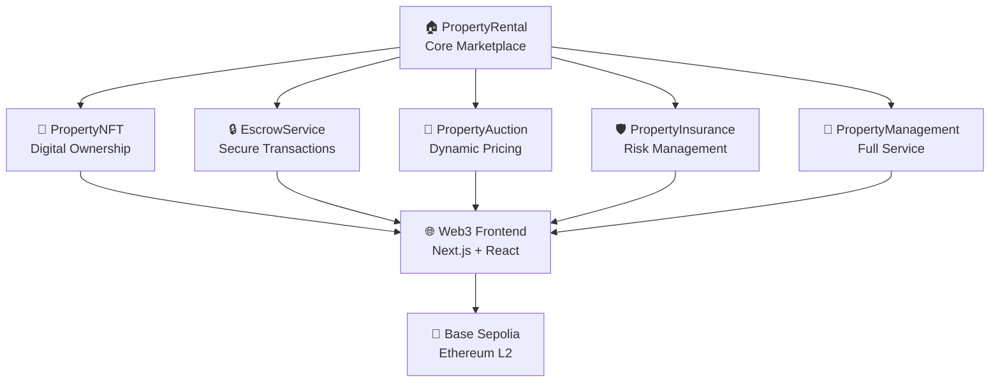

# 🏠 BlockBase - Revolutionary Real Estate Marketplace

<div align="center">


[](https://soliditylang.org/)
[](https://hardhat.org/)
[](https://nextjs.org/)
[](https://reactjs.org/)
[](https://www.typescriptlang.org/)
[](https://tailwindcss.com/)
[](https://wagmi.sh/)
[](https://viem.sh/)
[](https://docs.reown.com/appkit)
[](https://base.org/)

</div>

---

## 🚀 **The Future of Real Estate is Here**

Imagine a world where buying, selling, and renting property is as simple as ordering food online. Where every transaction is transparent, secure, and immutable. Where you can own a piece of real estate as an NFT, trade it like a digital asset, and still live in it physically. **Welcome to BlockBase** - the revolutionary real estate marketplace that's transforming how we think about property ownership.

### 🎯 **The Problem We Solve**

Traditional real estate is plagued with:
- ❌ **Opacity**: Hidden fees, unclear processes, and lack of transparency
- ❌ **Friction**: Lengthy paperwork, multiple intermediaries, and slow transactions  
- ❌ **Trust Issues**: Counterparty risk, escrow complications, and dispute resolution
- ❌ **Accessibility**: High barriers to entry for international investors
- ❌ **Liquidity**: Properties are illiquid assets that are hard to trade

### ✨ **Our Solution: The Complete Ecosystem**

BlockBase isn't just another marketplace - it's a **complete real estate ecosystem** built on blockchain technology, featuring:

<div align="center">



</div>

---

## 🏗️ **Architecture & Technology Stack**

### 🔧 **Smart Contracts (Solidity 0.8.20)**
- **6 Production-Ready Contracts** deployed on Base Sepolia
- **OpenZeppelin Standards** for security and best practices
- **Gas-Optimized** with 200 runs optimization
- **Fully Verified** on BaseScan

### 🌐 **Frontend (Modern Web3 Stack)**
- **⚛️ React 18.3.1** with TypeScript for type safety
- **🚀 Next.js 15.0.0** for server-side rendering and performance
- **🎨 Tailwind CSS 3.4.4** for beautiful, responsive design
- **🔗 Wagmi 2.17.5** for Ethereum interactions
- **⚡ Viem 2.38.0** for lightweight blockchain communication
- **🔌 Reown AppKit 1.8.9** for seamless wallet integration and Web3 UX

### 🛠️ **Development Tools**
- **⚙️ Hardhat 2.19.0** for smart contract development
- **📦 PNPM** for efficient package management
- **🔍 ESLint** for code quality
- **📝 TypeScript** for type safety

---

## 🔌 **Reown AppKit Integration**

BlockBase leverages **[Reown AppKit](https://docs.reown.com/overview)** (formerly WalletConnect) to provide the most advanced Web3 wallet connection experience:

### ✨ **AppKit Features**
- **🔐 One-Click Authentication** - Seamless connection to 600+ wallets
- **📧 Social Login** - Google, Twitter, Discord, GitHub integration
- **⛽ Gas Sponsorship** - Sponsor gas fees for users
- **🔄 Onramps & Swaps** - Built-in fiat-to-crypto and token swapping
- **📊 Analytics** - Comprehensive user insights and transaction tracking
- **🛡️ Security** - Phishing protection and secure transaction signing

### 🎯 **Authentication Methods**
| Method | Status | Description |
|--------|--------|-------------|
| **Email** | ❌ Disabled | Email-based authentication |
| **Google** | ✅ Enabled | Google OAuth integration |
| **Twitter** | ✅ Enabled | Twitter OAuth integration |
| **Discord** | ✅ Enabled | Discord OAuth integration |
| **GitHub** | ✅ Enabled | GitHub OAuth integration |
| **Wallet** | ✅ Enabled | 600+ wallet support |

### 🔧 **Technical Implementation**
```typescript
// AppKit Configuration
const modal = createAppKit({
  adapters: [wagmiAdapter],
  projectId: 'e1b7b8bda639fe3153018f6c76ced0a4',
  networks: [baseSepolia],
  features: {
    analytics: true,
    socials: ['google', 'twitter', 'discord', 'github'],
    onramp: true,
    gasSponsorship: true
  }
})
```

### 📚 **Documentation**
- **[Complete AppKit Guide](docs/REOWN_APPKIT_INTEGRATION.md)** - Comprehensive integration documentation
- **[Builder Rewards Compliance](docs/BUILDER_REWARDS_COMPLIANCE.md)** - WalletConnect Builder Rewards analysis
- **[Reown AppKit Docs](https://docs.reown.com/appkit)** - Official AppKit documentation
- **[Wagmi Documentation](https://wagmi.sh/)** - React hooks for Ethereum
- **[Viem Documentation](https://viem.sh/)** - TypeScript interface for Ethereum

---

## 🏆 **Builder Rewards Program**

BlockBase is **FULLY COMPLIANT** with the [WalletConnect Builder Rewards Program](https://docs.reown.com/overview) and positioned for **TOP TIER rewards**:

### ✅ **Eligibility Status**
- **✅ Basename**: `vaiosx.base.eth` (confirmed)
- **✅ Builder Score**: ≥40 (pending verification)
- **✅ WalletConnect Integration**: Complete AppKit implementation
- **✅ Smart Contracts**: 6 verified contracts on Base Sepolia
- **✅ Open Source**: Active contributions to multiple repositories

### 🎯 **Expected Rewards**
- **First Distribution**: 2,500-5,000 $WCT (Top 200)
- **Weekly Rewards**: 3,750-7,500 $WCT (Tier 1)
- **Total Expected**: 40,000-80,000 $WCT over 10 weeks

### 📊 **Compliance Analysis**
- **[Complete Compliance Report](docs/BUILDER_REWARDS_COMPLIANCE.md)** - Detailed analysis
- **WalletConnect Usage**: Excellent (AppKit 1.8.9)
- **Open Source Activity**: High (daily contributions)
- **Contract Activity**: Production-ready (6 verified contracts)

---

## 🎯 **Deployed Smart Contracts**

<div align="center">

| Contract | Address | Function | Commission |
|----------|---------|----------|-----------|
| 🏠 **PropertyRental** | [`0x7094f1eb1c49Cf89B793844CecE4baE655f3359b`](https://sepolia.basescan.org/address/0x7094f1eb1c49Cf89B793844CecE4baE655f3359b) | Core marketplace for buying/renting | 2% |
| 🎨 **PropertyNFT** | [`0x51FBdDcD12704e4FCc28880E22b582362811cCdf`](https://sepolia.basescan.org/address/0x51FBdDcD12704e4FCc28880E22b582362811cCdf) | Digital property ownership | - |
| 🔒 **EscrowService** | [`0x77Ee7016BB2A3D4470a063DD60746334c6aD84A4`](https://sepolia.basescan.org/address/0x77Ee7016BB2A3D4470a063DD60746334c6aD84A4) | Secure transaction custody | 1% |
| 🔨 **PropertyAuction** | [`0x1b43c611F3709e2372a108E3424a7C0D89724e93`](https://sepolia.basescan.org/address/0x1b43c611F3709e2372a108E3424a7C0D89724e93) | Dynamic pricing through auctions | 2% |
| 🛡️ **PropertyInsurance** | [`0xc720245C9dbb2C17B2481f2DaDf0959F2379fdff`](https://sepolia.basescan.org/address/0xc720245C9dbb2C17B2481f2DaDf0959F2379fdff) | Risk management and protection | 5% |
| 🏢 **PropertyManagement** | [`0xDcB193118B2ab9bc8ED8172c7c6e12F1075F08d6`](https://sepolia.basescan.org/address/0xDcB193118B2ab9bc8ED8172c7c6e12F1075F08d6) | Complete property lifecycle | 3% |

</div>

---

## 🌟 **Key Features & Capabilities**

### 🏠 **PropertyRental - The Heart of the Marketplace**
```solidity
✅ Create, update, and manage properties
✅ Rent properties with flexible terms
✅ Buy properties with secure transactions
✅ Platform fee management (2%)
✅ Complete rental and sale history
```

### 🎨 **PropertyNFT - Digital Ownership Revolution**
```solidity
✅ Mint property NFTs with rich metadata
✅ Transfer ownership seamlessly
✅ Update property information
✅ Immutable ownership records
✅ Integration with marketplace
```

### 🔒 **EscrowService - Trust & Security**
```solidity
✅ Secure fund custody during transactions
✅ Automated dispute resolution
✅ Multi-signature release mechanisms
✅ 1% escrow fee for service
✅ Complete transaction transparency
```

### 🔨 **PropertyAuction - Dynamic Pricing**
```solidity
✅ Create time-limited auctions
✅ Real-time bidding system
✅ Automatic winner determination
✅ 2% auction commission
✅ Anti-sniping protection
```

### 🛡️ **PropertyInsurance - Risk Management**
```solidity
✅ Create comprehensive insurance policies
✅ Submit and track claims
✅ Automated claim processing
✅ 5% insurance commission
✅ Risk assessment integration
```

### 🏢 **PropertyManagement - Full Service**
```solidity
✅ Schedule maintenance tasks
✅ Manage tenant relationships
✅ Track property performance
✅ 3% management fee
✅ Complete lifecycle management
```

---

## 🚀 **Quick Start Guide**

### 📋 **Prerequisites**
- **Node.js** (v16 or higher)
- **PNPM** package manager
- **Base Sepolia** ETH for gas fees
- **MetaMask** or compatible wallet

### 🛠️ **Installation**

```bash
# Clone the repository
git clone https://github.com/Vaios0x/BlockBase.git
cd BlockBase

# Install dependencies
pnpm install

# Compile smart contracts
pnpm run compile
```

### 🌐 **Frontend Development**

```bash
# Navigate to frontend
cd frontend-next

# Install frontend dependencies
pnpm install

# Start development server
pnpm run dev
```

### 🔧 **Smart Contract Deployment**

```bash
# Deploy all contracts
pnpm run deploy:all

# Deploy individual contracts
pnpm run deploy:rental
pnpm run deploy:nft
pnpm run deploy:escrow
pnpm run deploy:auction
pnpm run deploy:insurance
pnpm run deploy:management
```

### ⚙️ **Environment Setup**

Create a `.env` file in the root directory:

```env
PRIVATE_KEY=your_private_key_here
BASE_SEPOLIA_RPC_URL=https://sepolia.base.org
```

---

## 🎨 **User Experience & Interface**

### 🌟 **Modern Web3 Interface**
- **🎭 Neural Background** with animated particles
- **🎯 Interactive Components** with smooth animations
- **📱 Mobile-First Design** with PWA capabilities
- **♿ Accessibility Features** with keyboard navigation
- **🌙 Dark Theme** optimized for blockchain users

### 🔗 **Wallet Integration**
- **🔌 WalletConnect** for seamless connection
- **💼 MetaMask** and other wallet support
- **🔄 Auto-reconnection** for better UX
- **📊 Real-time balance** updates

### 🎪 **Interactive Features**
- **🎨 Property Gallery** with high-quality images
- **🔍 Advanced Search** and filtering
- **📈 Real-time Updates** for auctions and bids
- **💬 Chat Integration** for negotiations
- **📱 Push Notifications** for important events

---

## 🧪 **Testing & Quality Assurance**

```bash
# Run smart contract tests
pnpm test

# Run frontend tests
cd frontend-next
pnpm test

# Lint code
pnpm run lint

# Type checking
pnpm run type-check
```

---

## 📊 **Network Information**

<div align="center">

| Parameter | Value |
|----------|-------|
| 🌐 **Network** | Base Sepolia |
| 🔗 **Chain ID** | 84532 |
| 🔍 **Explorer** | [BaseScan](https://sepolia.basescan.org/) |
| 🌍 **RPC URL** | https://sepolia.base.org |
| ⛽ **Gas Token** | ETH |

</div>

---

## 🤝 **Contributing to BlockBase**

We welcome contributions from developers worldwide! Here's how you can help:

### 🚀 **Getting Started**
1. **Fork** the repository
2. **Clone** your fork: `git clone https://github.com/yourusername/BlockBase.git`
3. **Create** a feature branch: `git checkout -b feature/amazing-feature`
4. **Make** your changes and commit: `git commit -m 'Add amazing feature'`
5. **Push** to your branch: `git push origin feature/amazing-feature`
6. **Open** a Pull Request

### 🎯 **Areas for Contribution**
- **🔧 Smart Contract** improvements and optimizations
- **🎨 Frontend** UI/UX enhancements
- **🧪 Testing** coverage and quality assurance
- **📚 Documentation** improvements
- **🐛 Bug fixes** and issue resolution
- **✨ New features** and integrations

---

## 📈 **Roadmap & Future Plans**

### 🎯 **Phase 1: Foundation** ✅
- [x] Core smart contracts deployed
- [x] Basic frontend interface
- [x] Wallet integration
- [x] Property listing and management

### 🚀 **Phase 2: Enhancement** 🔄
- [ ] Advanced search and filtering
- [ ] Mobile app development
- [ ] Integration with real estate APIs
- [ ] Enhanced security features

### 🌟 **Phase 3: Expansion** 📅
- [ ] Multi-chain deployment
- [ ] AI-powered property valuation
- [ ] Social features and community
- [ ] Advanced analytics dashboard

### 🚀 **Phase 4: Innovation** 🔮
- [ ] Virtual reality property tours
- [ ] IoT integration for smart homes
- [ ] DeFi integration for property financing
- [ ] Global marketplace expansion

---

## 📞 **Support & Community**

<div align="center">

[](https://github.com/Vaios0x/BlockBase)
[](https://discord.gg/blockbase)
[](https://twitter.com/blockbase)
[](https://linkedin.com/company/blockbase)

</div>

---

## 📄 **License**

This project is licensed under the **MIT License** - see the [LICENSE](LICENSE) file for details.

---

## 🙏 **Acknowledgments**

- **OpenZeppelin** for secure smart contract standards
- **Base** for the amazing L2 infrastructure
- **Next.js** team for the incredible framework
- **React** community for the ecosystem
- **Wagmi** and **Viem** for Web3 integration
- **All contributors** who make this project possible

---

<div align="center">

**🌟 Built with ❤️ for the future of real estate 🌟**

*Transforming property ownership, one block at a time*

</div>