# 🔗 Reown AppKit Integration Guide

<div align="center">


[](https://walletconnect.com/)
[](https://wagmi.sh/)
[](https://viem.sh/)

</div>

---

## 🚀 **What is Reown AppKit?**

[Reown AppKit](https://docs.reown.com/overview) (formerly WalletConnect) is the most advanced Web3 wallet connection solution that empowers builders to create secure, user-friendly, and insight-rich wallet and app UX. It provides all the tools needed to launch faster and scale smarter.

### ✨ **Key Features**

- **🔐 One-Click Authentication** - Seamless wallet connections across 600+ wallets
- **🌐 Multi-Chain Support** - Built-in support for Ethereum, Base, Polygon, and more
- **📧 Social Login** - Email and social authentication options
- **⛽ Gas Sponsorship** - Sponsor gas fees for your users
- **🔄 Onramps & Swaps** - Integrated fiat-to-crypto and token swapping
- **📊 Analytics** - Built-in user insights and transaction tracking
- **🛡️ Security** - Phishing protection and secure transaction signing

---

## 🏗️ **BlockBase Integration Architecture**

```mermaid
graph TB
    A[🌐 BlockBase Frontend] --> B[🔗 Reown AppKit]
    B --> C[⚡ Wagmi Adapter]
    C --> D[🔧 Viem Client]
    D --> E[📡 Base Sepolia]
    
    B --> F[👤 User Authentication]
    B --> G[💼 Wallet Connection]
    B --> H[⛽ Gas Sponsorship]
    B --> I[🔄 Onramp Services]
    
    F --> J[📧 Email Login]
    F --> K[🐦 Social Login]
    F --> L[🔐 Wallet Auth]
    
    G --> M[600+ Wallets]
    G --> N[🔒 Secure Signing]
    G --> O[📱 Mobile Support]
```

<div align="center">



</div>

---

## 📦 **Dependencies & Installation**

### **Core Dependencies**

```json
{
  "@reown/appkit": "^1.8.9",
  "@reown/appkit-adapter-wagmi": "^1.8.9",
  "wagmi": "^2.17.5",
  "viem": "^2.38.0",
  "@tanstack/react-query": "^5.90.2"
}
```

### **Installation Commands**

```bash
# Install Reown AppKit
pnpm add @reown/appkit @reown/appkit-adapter-wagmi

# Install Web3 dependencies
pnpm add wagmi viem @tanstack/react-query

# Install development dependencies
pnpm add -D @types/react @types/react-dom typescript
```

---

## ⚙️ **Configuration Setup**

### **1. Project ID Configuration**

```typescript
// src/config/wagmi.ts
import { createAppKit } from '@reown/appkit/react'
import { createConfig, http } from 'wagmi'
import { baseSepolia } from '@reown/appkit/networks'
import { wagmiAdapter } from '@reown/appkit-adapter-wagmi'

export const projectId = 'e1b7b8bda639fe3153018f6c76ced0a4'

export const config = createConfig({
  chains: [baseSepolia],
  transports: {
    [baseSepolia.id]: http('https://sepolia.base.org'),
  },
})

export const wagmiAdapter = wagmiAdapter({
  projectId,
  networks: [baseSepolia],
  defaultNetwork: baseSepolia,
})
```

### **2. AppKit Provider Setup**

```typescript
// src/context/AppKitProvider.tsx
import { createAppKit } from '@reown/appkit/react'
import { baseSepolia } from '@reown/appkit/networks'

const modal = createAppKit({
  adapters: [wagmiAdapter],
  projectId,
  networks: [baseSepolia],
  defaultNetwork: baseSepolia,
  metadata: {
    name: 'BlockBase - Real Estate Marketplace',
    description: 'Advanced blockchain platform for renting, selling and managing real estate properties with Web3 technology.',
    url: 'https://blockbase.app',
    icons: ['https://avatars.githubusercontent.com/u/179229932']
  },
  features: {
    analytics: true,
    email: false,
    socials: ['google', 'twitter', 'discord', 'github'],
    emailShowWallets: true,
    onramp: true,
    walletFeatures: {
      email: false,
      socials: ['google', 'twitter', 'discord', 'github']
    }
  }
})
```

---

## 🎯 **Component Implementation**

### **1. Wallet Connection Component**

```typescript
// src/components/AppKitWalletConnect.tsx
'use client'

import { useAccount, useDisconnect, useBalance } from 'wagmi'
import { useAppKit } from '@reown/appkit/react'

export default function AppKitWalletConnect() {
  const { address, isConnected } = useAccount()
  const { disconnect } = useDisconnect()
  const { data: balance } = useBalance({ address })
  const { open } = useAppKit()

  return (
    <div className="wallet-connection">
      {isConnected ? (
        <div className="connected-wallet">
          <span>{address?.slice(0, 6)}...{address?.slice(-4)}</span>
          <span>{balance?.formatted} {balance?.symbol}</span>
          <button onClick={() => disconnect()}>Disconnect</button>
        </div>
      ) : (
        <button onClick={() => open()}>
          Connect Wallet
        </button>
      )}
    </div>
  )
}
```

### **2. Web Components Usage**

```html
<!-- Direct Web Components -->
<appkit-button />
<appkit-connect-button />
<appkit-connect-modal />
```

### **3. React Hooks Integration**

```typescript
// src/hooks/useWalletConnection.ts
import { useAccount, useConnect, useDisconnect } from 'wagmi'
import { useAppKit } from '@reown/appkit/react'

export function useWalletConnection() {
  const { address, isConnected } = useAccount()
  const { open } = useAppKit()
  const { disconnect } = useDisconnect()

  return {
    address,
    isConnected,
    connect: open,
    disconnect
  }
}
```

---

## 🌟 **Advanced Features**

### **🔐 Authentication Methods**

| Method | Status | Description |
|--------|--------|-------------|
| **Email** | ❌ Disabled | Email-based authentication |
| **Google** | ✅ Enabled | Google OAuth integration |
| **Twitter** | ✅ Enabled | Twitter OAuth integration |
| **Discord** | ✅ Enabled | Discord OAuth integration |
| **GitHub** | ✅ Enabled | GitHub OAuth integration |
| **Wallet** | ✅ Enabled | 600+ wallet support |

### **⛽ Gas Sponsorship**

```typescript
// Enable gas sponsorship for users
const modal = createAppKit({
  // ... other config
  features: {
    gasSponsorship: true,
    paymaster: {
      url: 'https://your-paymaster-url.com'
    }
  }
})
```

### **🔄 Onramp Integration**

```typescript
// Enable fiat-to-crypto onramps
const modal = createAppKit({
  // ... other config
  features: {
    onramp: true,
    onrampProviders: ['moonpay', 'transak', 'coinbase']
  }
})
```

### **📊 Analytics & Monitoring**

```typescript
// Built-in analytics
const modal = createAppKit({
  // ... other config
  features: {
    analytics: true,
    tracking: {
      events: ['connect', 'disconnect', 'transaction'],
      userProperties: true
    }
  }
})
```

---

## 🎨 **Customization & Theming**

### **Theme Configuration**

```typescript
const modal = createAppKit({
  // ... other config
  themeMode: 'dark',
  themeVariables: {
    '--w3m-color-mix': '#6366f1',
    '--w3m-color-mix-strength': 40,
    '--w3m-border-radius-master': '12px',
    '--w3m-font-family-master': 'Inter, sans-serif'
  }
})
```

### **Custom Styling**

```css
/* Custom CSS for AppKit components */
appkit-button {
  --w3m-accent: #8b5cf6;
  --w3m-border-radius: 12px;
  --w3m-font-size-master: 14px;
}

appkit-connect-modal {
  --w3m-background-color: #0f0f23;
  --w3m-container-border-radius: 20px;
}
```

---

## 🚀 **Smart Contract Integration**

### **Contract Interaction Example**

```typescript
// src/hooks/usePropertyRental.ts
import { useContractRead, useContractWrite } from 'wagmi'
import { propertyRentalABI } from '@/contracts/PropertyRental'

export function usePropertyRental() {
  const { data: properties } = useContractRead({
    address: '0x7094f1eb1c49Cf89B793844CecE4baE655f3359b',
    abi: propertyRentalABI,
    functionName: 'getAllProperties'
  })

  const { write: createProperty } = useContractWrite({
    address: '0x7094f1eb1c49Cf89B793844CecE4baE655f3359b',
    abi: propertyRentalABI,
    functionName: 'createProperty'
  })

  return { properties, createProperty }
}
```

### **Transaction Handling**

```typescript
// Handle transaction states
const { write: rentProperty, isLoading, isSuccess, error } = useContractWrite({
  address: contractAddress,
  abi: propertyRentalABI,
  functionName: 'rentProperty',
  onSuccess: (data) => {
    console.log('Transaction successful:', data)
  },
  onError: (error) => {
    console.error('Transaction failed:', error)
  }
})
```

---

## 📱 **PWA Integration**

### **Service Worker Configuration**

```typescript
// next.config.js
const withPWA = require('next-pwa')({
  dest: 'public',
  register: true,
  skipWaiting: true,
  disable: process.env.NODE_ENV === 'development'
})

module.exports = withPWA({
  // ... other config
})
```

### **Manifest Configuration**

```json
{
  "name": "BlockBase - Real Estate Marketplace",
  "short_name": "BlockBase",
  "description": "Advanced blockchain platform for real estate",
  "start_url": "/",
  "display": "standalone",
  "background_color": "#0f0f23",
  "theme_color": "#8b5cf6",
  "icons": [
    {
      "src": "/icon-192x192.png",
      "sizes": "192x192",
      "type": "image/png"
    }
  ]
}
```

---

## 🔒 **Security Best Practices**

### **1. Project ID Security**

```typescript
// Use environment variables
const projectId = process.env.NEXT_PUBLIC_REOWN_PROJECT_ID

if (!projectId) {
  throw new Error('Project ID is required')
}
```

### **2. Network Validation**

```typescript
// Validate network before transactions
const { chain } = useAccount()

if (chain?.id !== baseSepolia.id) {
  throw new Error('Please switch to Base Sepolia network')
}
```

### **3. Error Handling**

```typescript
// Comprehensive error handling
try {
  await writeContract({
    address: contractAddress,
    abi: contractABI,
    functionName: 'functionName',
    args: [args]
  })
} catch (error) {
  if (error.code === 'USER_REJECTED') {
    // User rejected transaction
  } else if (error.code === 'INSUFFICIENT_FUNDS') {
    // Insufficient funds
  } else {
    // Other errors
  }
}
```

---

## 📊 **Analytics & Monitoring**

### **Built-in Analytics**

Reown AppKit provides comprehensive analytics out of the box:

- **🔗 Connection Events** - Wallet connection tracking
- **💸 Transaction Events** - Transaction success/failure rates
- **👤 User Behavior** - User interaction patterns
- **⚡ Performance Metrics** - Connection speed and reliability

### **Custom Analytics**

```typescript
// Custom event tracking
import { useAppKit } from '@reown/appkit/react'

const { track } = useAppKit()

// Track custom events
track('property_created', {
  propertyId: '123',
  price: '1000000000000000000',
  location: 'New York'
})
```

---

## 🚀 **Deployment Guide**

### **1. Environment Setup**

```bash
# .env.local
NEXT_PUBLIC_REOWN_PROJECT_ID=e1b7b8bda639fe3153018f6c76ced0a4
NEXT_PUBLIC_BASE_SEPOLIA_RPC=https://sepolia.base.org
NEXT_PUBLIC_CHAIN_ID=84532
```

### **2. Build Configuration**

```bash
# Build for production
pnpm build

# Start production server
pnpm start

# Deploy to Vercel
vercel deploy
```

### **3. Domain Configuration**

1. **Reown Dashboard** - Configure your domain
2. **CORS Settings** - Allow your domain
3. **Analytics** - Enable tracking
4. **Features** - Configure available features

---

## 🛠️ **Development Workflow**

### **Local Development**

```bash
# Start development server
pnpm dev

# Run tests
pnpm test

# Lint code
pnpm lint

# Type check
pnpm type-check
```

### **Testing Strategy**

```typescript
// Test wallet connection
import { renderHook } from '@testing-library/react'
import { useWalletConnection } from '@/hooks/useWalletConnection'

test('should connect wallet', async () => {
  const { result } = renderHook(() => useWalletConnection())
  
  await act(async () => {
    await result.current.connect()
  })
  
  expect(result.current.isConnected).toBe(true)
})
```

---

## 📚 **Resources & Documentation**

### **Official Documentation**

- **[Reown AppKit Docs](https://docs.reown.com/appkit)** - Complete AppKit documentation
- **[Wagmi Documentation](https://wagmi.sh/)** - React hooks for Ethereum
- **[Viem Documentation](https://viem.sh/)** - TypeScript interface for Ethereum
- **[Base Network Docs](https://docs.base.org/)** - Base network documentation

### **Community Resources**

- **[Reown Discord](https://discord.gg/reown)** - Community support
- **[GitHub Repository](https://github.com/reown/appkit)** - Source code
- **[Examples Gallery](https://docs.reown.com/appkit/examples)** - Code examples

### **Tutorials & Guides**

- **[Build a Web3 App in 10 minutes](https://docs.reown.com/guides/build-a-web3-app-in-10-minutes)** - Quick start guide
- **[Multi-Chain Development](https://docs.reown.com/guides/multi-chain)** - Multi-chain setup
- **[Gas Sponsorship Guide](https://docs.reown.com/guides/gas-sponsorship)** - Gas fee sponsorship

---

## 🤝 **Support & Contributing**

### **Getting Help**

- **📖 Documentation** - Comprehensive guides and API reference
- **💬 Discord** - Real-time community support
- **🐛 GitHub Issues** - Bug reports and feature requests
- **📧 Email Support** - Direct technical support

### **Contributing to BlockBase**

We welcome contributions! Here's how you can help:

1. **🐛 Report Bugs** - Help us identify and fix issues
2. **✨ Feature Requests** - Suggest new features
3. **📝 Documentation** - Improve our docs
4. **🧪 Testing** - Help us test new features
5. **💻 Code Contributions** - Submit pull requests

---

## 🎯 **Best Practices Summary**

### **✅ Do's**

- Use environment variables for sensitive data
- Implement proper error handling
- Test on multiple networks
- Monitor analytics and performance
- Keep dependencies updated
- Follow security best practices

### **❌ Don'ts**

- Don't hardcode private keys
- Don't ignore error states
- Don't skip network validation
- Don't forget to handle loading states
- Don't ignore user experience
- Don't skip testing

---

<div align="center">

**🌟 Built with Reown AppKit for the future of Web3 🌟**

*Empowering the next generation of blockchain applications*

</div>
